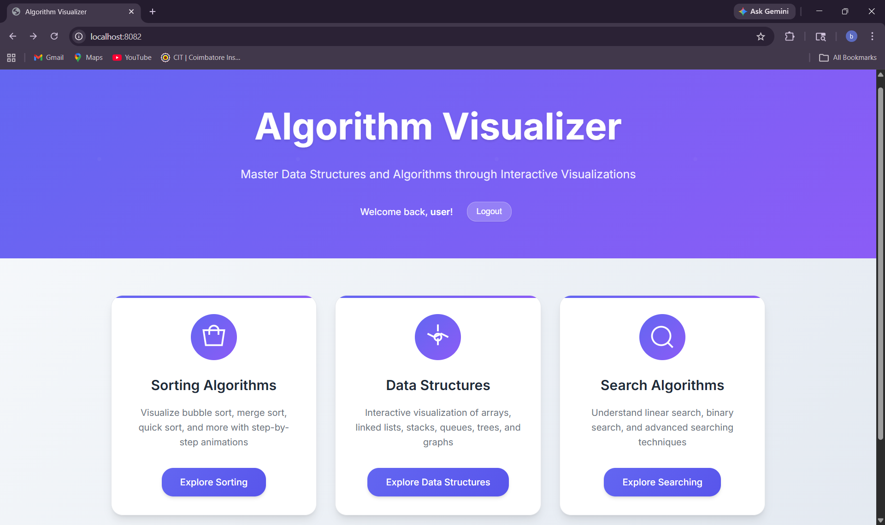
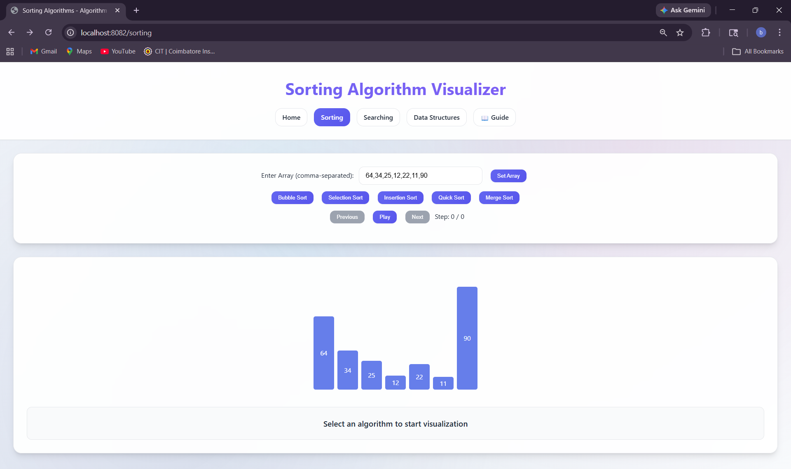
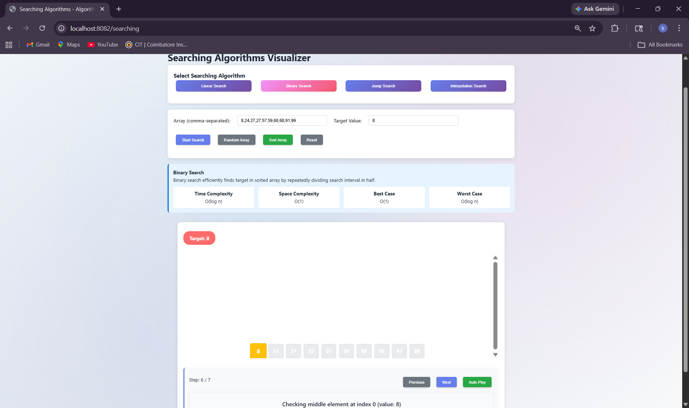
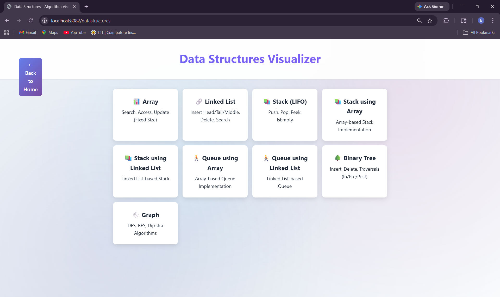

# 🚀 Algorithm Visualizer

A comprehensive web application for visualizing and learning algorithms interactively. Built with Spring Boot, MySQL, and modern web technologies.

## 📋 Table of Contents
- [Demo](#demo)
- [Screenshots](#screenshots)
- [Features](#features)
- [Tech Stack](#tech-stack)
- [Prerequisites](#prerequisites)
- [Installation & Setup](#installation--setup)
- [Database Setup](#database-setup)
- [Running the Application](#running-the-application)
- [Project Structure](#project-structure)
- [API Endpoints](#api-endpoints)
- [Contributing](#contributing)
- [Troubleshooting](#troubleshooting)

## 🎥 Demo

### Merge Sort Visualization

https://github.com/user-attachments/assets/6aab81c3-94a1-435f-998f-83cbd6c853c8

---

## 📸 Screenshots

### 🏠 Home


### 📊 Sorting Algorithms


### 🔍 Searching Algorithms


### 🗂️ Data Structures


---

## ✨ Features

### 🔄 Sorting Algorithms
- **Bubble Sort** - Step-by-step bubble comparison visualization
- **Selection Sort** - Finding minimum elements with visual selection
- **Insertion Sort** - Card-like insertion with shifting animation
- **Merge Sort** - Divide and conquer with array splitting visualization
- **Quick Sort** - Pivot-based partitioning with recursive calls
- **Heap Sort** - Binary heap operations and sorting

### 🔍 Searching Algorithms
- **Linear Search** - Sequential element checking
- **Binary Search** - Efficient sorted array searching
- **Jump Search** - Block-based searching optimization
- **Interpolation Search** - Value-based position estimation

### 📊 Data Structures
- **Arrays** - Search, Access, Update operations (Fixed-size)
- **Linked Lists** - Dynamic insertion, deletion, traversal
- **Stacks** - LIFO operations (Push, Pop, Peek)
- **Queues** - FIFO operations (Enqueue, Dequeue)
- **Binary Trees** - Insert, Delete, Traversals
- **Graphs** - BFS, DFS algorithms

### 📈 Analytics Dashboard
- **Learning Progress** - Track algorithm mastery
- **Time Investment** - Monitor learning hours
- **Achievement System** - Badges and milestones
- **Skill Levels** - Visual progress indicators

## 🛠 Tech Stack

### Backend
- **Java 17+** - Programming language
- **Spring Boot 3.x** - Application framework
- **Spring Data JPA** - Database abstraction
- **MySQL 8.0+** - Database
- **Maven** - Dependency management

### Frontend
- **HTML5** - Structure
- **CSS3** - Styling with modern features
- **JavaScript (ES6+)** - Interactive functionality
- **Thymeleaf** - Server-side templating

### Tools
- **Git** - Version control
- **IntelliJ IDEA / VS Code** - IDE
- **MySQL Workbench** - Database management

## 📋 Prerequisites

Before setting up the project, ensure you have:

1. **Java Development Kit (JDK) 17 or higher**
   ```bash
   java -version
   ```

2. **Apache Maven 3.6+**
   ```bash
   mvn -version
   ```

3. **MySQL Server 8.0+**
   ```bash
   mysql --version
   ```

4. **Git**
   ```bash
   git --version
   ```

## 🚀 Installation & Setup

### 1. Clone the Repository
```bash
git clone https://github.com/bharathjr05-dot/Algorithm-Visualizer.git
cd AlgorithmVisualizer
```

### 2. Configure Database Connection
Edit `src/main/resources/application.properties`:
```properties
# Database Configuration
spring.datasource.url=jdbc:mysql://localhost:3306/algorithm_visualizer
spring.datasource.username=root
spring.datasource.password=

# JPA Configuration
spring.jpa.hibernate.ddl-auto=update
spring.jpa.show-sql=true
spring.jpa.properties.hibernate.dialect=org.hibernate.dialect.MySQL8Dialect

# Server Configuration
server.port=8082
```

### 3. Install Dependencies
```bash
mvn clean install
```

## 🗄️ Database Setup

### 1. Create Database
```sql
CREATE DATABASE algorithm_visualizer;
USE algorithm_visualizer;
```

### 2. Run Database Setup Script
Execute the provided SQL script:
```bash
mysql -u root -p algorithm_visualizer < database_setup_complete.sql
```

### 3. Verify Tables
Check if tables are created:
```sql
SHOW TABLES;
```

Expected tables:
- `algorithms`
- `users`
- `user_sessions`
- `user_progress`

## ▶️ Running the Application

### Option 1: Using Maven
```bash
mvn spring-boot:run
```

### Option 2: Using Batch File (Windows)
```bash
run_application.bat
```

### Option 3: Using JAR
```bash
mvn clean package
java -jar target/algorithm-visualizer-1.0.0.jar
```

### Access the Application
Open your browser and navigate to:
```
http://localhost:8082
```

## 📁 Project Structure

```
AlgorithmVisualizer/
├── src/
│   ├── main/
│   │   ├── java/com/algorithmvisualizer/
│   │   │   ├── controller/          # REST Controllers
│   │   │   │   ├── AlgorithmController.java
│   │   │   │   └── WebController.java
│   │   │   ├── model/               # Entity Classes
│   │   │   │   ├── Algorithm.java
│   │   │   │   ├── User.java
│   │   │   │   ├── UserSession.java
│   │   │   │   └── AlgorithmStep.java
│   │   │   ├── repository/          # Data Access Layer
│   │   │   │   ├── AlgorithmRepository.java
│   │   │   │   ├── UserRepository.java
│   │   │   │   └── UserSessionRepository.java
│   │   │   ├── service/             # Business Logic
│   │   │   │   ├── AlgorithmSessionService.java
│   │   │   │   └── UserService.java
│   │   │   ├── algorithm/           # Algorithm Implementations
│   │   │   │   ├── SortingAlgorithms.java
│   │   │   │   └── SearchingAlgorithms.java
│   │   │   └── AlgorithmVisualizerApplication.java
│   │   └── resources/
│   │       ├── templates/           # HTML Templates
│   │       │   ├── index.html
│   │       │   ├── sorting.html
│   │       │   ├── searching.html
│   │       │   ├── datastructures.html
│   │       │   ├── array.html
│   │       │   └── analytics.html
│   │       ├── static/
│   │       │   ├── css/             # Stylesheets
│   │       │   │   ├── style.css
│   │       │   │   └── datastructures.css
│   │       │   └── js/              # JavaScript Files
│   │       │       ├── sorting.js
│   │       │       ├── searching.js
│   │       │       ├── datastructures.js
│   │       │       └── array.js
│   │       └── application.properties
├── assets/                         # Screenshots
│   ├── Home.png
│   ├── Sorting.png
│   ├── Searching.png
│   └── DataStructures.png
├── database_setup_complete.sql     # Database Schema
├── run_application.bat             # Windows Startup Script
├── pom.xml                        # Maven Configuration
└── README.md                      # This file
```

## 🔌 API Endpoints

### Sorting Algorithms
- `POST /api/algorithms/bubble-sort` - Bubble sort visualization
- `POST /api/algorithms/selection-sort` - Selection sort visualization
- `POST /api/algorithms/insertion-sort` - Insertion sort visualization
- `POST /api/algorithms/merge-sort` - Merge sort visualization
- `POST /api/algorithms/quick-sort` - Quick sort visualization
- `POST /api/algorithms/heap-sort` - Heap sort visualization

### Searching Algorithms
- `POST /api/algorithms/linear-search` - Linear search visualization
- `POST /api/algorithms/binary-search` - Binary search visualization
- `POST /api/algorithms/jump-search` - Jump search visualization
- `POST /api/algorithms/interpolation-search` - Interpolation search visualization

### Analytics
- `GET /api/analytics/top-performers` - Get top performing users
- `GET /api/analytics/algorithm-stats` - Get algorithm statistics
- `GET /api/algorithms/user/{userId}/sessions` - Get user sessions
- `GET /api/algorithms/user/{userId}/progress` - Get user progress

### Session Management
- `POST /api/algorithms/start-session` - Start learning session
- `POST /api/algorithms/complete-session` - Complete learning session

## 🤝 Contributing

### Development Workflow
1. **Create a new branch** for your feature
   ```bash
   git checkout -b feature/your-feature-name
   ```

2. **Make your changes** and test thoroughly

3. **Commit your changes**
   ```bash
   git add .
   git commit -m "Add: your feature description"
   ```

4. **Push to your branch**
   ```bash
   git push origin feature/your-feature-name
   ```

5. **Create a Pull Request**

### Code Style Guidelines
- Use **camelCase** for Java variables and methods
- Use **PascalCase** for Java classes
- Use **kebab-case** for CSS classes
- Add **comments** for complex algorithms
- Follow **Spring Boot** best practices

### Adding New Algorithms
1. **Implement algorithm** in appropriate class (`SortingAlgorithms.java` or `SearchingAlgorithms.java`)
2. **Add REST endpoint** in `AlgorithmController.java`
3. **Create frontend** visualization in corresponding JS file
4. **Add navigation** in HTML templates
5. **Update documentation**

## 🐛 Troubleshooting

### Common Issues

#### 1. Database Connection Failed
```
Error: Could not connect to MySQL
```
**Solution:**
- Ensure MySQL server is running
- Check username/password in `application.properties`
- Verify database exists

#### 2. Port Already in Use
```
Error: Port 8082 is already in use
```
**Solution:**
- Change port in `application.properties`
- Kill process using the port
- Use different port number

#### 3. Maven Build Failed
```
Error: Failed to execute goal
```
**Solution:**
- Check Java version (must be 17+)
- Clear Maven cache: `mvn clean`
- Update dependencies: `mvn clean install -U`

#### 4. Frontend Not Loading
```
Error: 404 Not Found for static resources
```
**Solution:**
- Check file paths in `static/` directory
- Verify Thymeleaf syntax in templates
- Clear browser cache

### Getting Help
- Check the **Issues** section in Git repository
- Review **console logs** for error details
- Verify **prerequisites** are installed correctly
